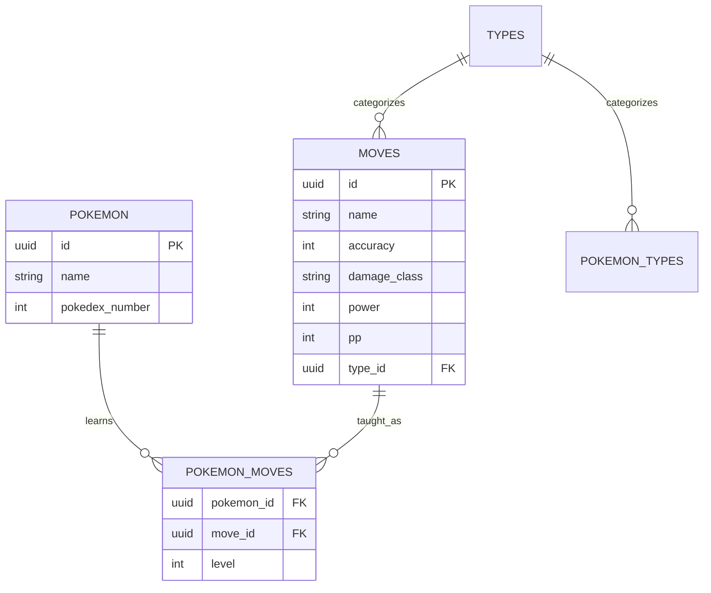

# Design Document

## Overview

This design document outlines the technical approach for extending the Pokédex application with move management, detailed Pokémon views, improved architecture, and admin functionality. The solution leverages the existing NestJS/Next.js stack with Drizzle ORM and follows established patterns in the codebase while introducing new features systematically.

## Architecture

### Database Layer Design

The database extension follows the existing Drizzle ORM patterns with proper entity relationships:

**Moves Table Schema:**
- `id`: UUID primary key with default random generation
- `name`: Text field for move name
- `accuracy`: Integer for move accuracy percentage
- `damageClass`: Text field for damage classification (physical/special/status)
- `power`: Nullable integer for move power
- `pp`: Integer for power points
- `typeId`: UUID foreign key referencing types table

**Pokemon Moves Join Table Schema:**
- `pokemonId`: UUID foreign key referencing pokemons table
- `moveId`: UUID foreign key referencing moves table
- `level`: Integer representing the level at which the move is learned
- Composite primary key on (pokemonId, moveId)

### API Layer Design

The API layer extends existing patterns with new endpoints and enhanced data retrieval:

**Enhanced Pokemon Repository:**
- Extend `findMultiplePokemon` to optionally include moves data
- Add `findPokemonById` method with full move relationships
- Implement `deletePokemon` method with proper authorization checks

**New Move Repository:**
- Follow BaseRepository pattern for consistency
- Implement standard CRUD operations
- Include type relationship queries

**Enhanced Pokemon Service:**
- Add `findPokemonWithMoves` method for detailed views
- Implement `deletePokemon` with admin authorization
- Maintain existing pagination and cursor-based queries

### Frontend Architecture Design

The frontend design emphasizes component composition and state management best practices:

**Component Hierarchy:**
```
HomePage
├── PokemonGrid
│   ├── PokemonCard
│   │   ├── PokemonImage
│   │   ├── PokemonTypes
│   │   └── PokemonActions (View/Delete buttons)
│   └── LoadingSkeletons
├── PokemonDetailModal
│   ├── PokemonInfo
│   ├── MovesTable
│   │   ├── SortableHeader
│   │   └── MoveRow
│   └── ModalControls
└── InfiniteScrollSentinel
```

## Components and Interfaces

### Database Entities

**Move Entity Interface:**
```typescript
interface MoveEntity {
  id: string;
  name: string;
  accuracy: number | null;
  damageClass: string;
  power: number | null;
  pp: number;
  typeId: string;
}
```

**Pokemon Move Entity Interface:**
```typescript
interface PokemonMoveEntity {
  pokemonId: string;
  moveId: string;
  level: number;
}
```

**Enhanced User Entity:**
```typescript
interface UserEntity {
  id: string;
  username: string;
  password: string;
  isAdmin: boolean; // New field
}
```

### API Interfaces

**Enhanced Pokemon Response:**
```typescript
interface PokemonWithMovesDto extends ViewPokemonDto {
  moves: PokemonMoveDto[];
}

interface PokemonMoveDto {
  id: string;
  name: string;
  level: number;
  power: number | null;
  accuracy: number | null;
  damageClass: string;
  type: ViewTypeDto;
}
```

### Frontend Component Interfaces

**Pokemon Detail Modal Props:**
```typescript
interface PokemonDetailModalProps {
  pokemonId: string | null;
  isOpen: boolean;
  onClose: () => void;
}
```

**Moves Table Props:**
```typescript
interface MovesTableProps {
  moves: PokemonMoveDto[];
  sortBy: 'level' | 'power';
  sortOrder: 'asc' | 'desc';
  onSort: (field: 'level' | 'power') => void;
}
```

## Data Models

### Enhanced Pokemon Data Flow

1. **Database Query:** Repository queries pokemon with moves using Drizzle relations
2. **Data Transformation:** Service layer transforms to DTOs with proper typing
3. **API Response:** Controller returns structured JSON with moves included
4. **Frontend State:** React Query manages caching and state synchronization
5. **UI Rendering:** Components receive typed props for consistent display

### Move Data Relationships



## Error Handling

### Database Error Handling
- **Migration Failures:** Rollback mechanisms with detailed error logging
- **Constraint Violations:** Proper foreign key error messages
- **Seed Data Issues:** Validation and partial success handling

### API Error Handling
- **Authorization Errors:** 403 responses for non-admin delete attempts
- **Not Found Errors:** 404 responses with helpful messages
- **Validation Errors:** 400 responses with field-specific details

### Frontend Error Handling
- **Network Errors:** Retry mechanisms with exponential backoff
- **Loading States:** Skeleton components and loading indicators
- **User Feedback:** Toast notifications for success/error states

## Testing Strategy

### Database Testing
- **Migration Tests:** Verify schema changes apply correctly
- **Seed Tests:** Validate data integrity and relationships
- **Repository Tests:** Unit tests for query methods

### API Testing
- **Controller Tests:** Endpoint behavior and response validation
- **Service Tests:** Business logic and authorization checks
- **Integration Tests:** End-to-end API workflows

### Frontend Testing
- **Component Tests:** React Testing Library for UI components
- **Hook Tests:** Custom hook behavior and state management
- **Integration Tests:** User interaction flows and API integration

### Performance Considerations

**Database Optimization:**
- Proper indexing on foreign keys and frequently queried fields
- Efficient join queries using Drizzle's relation system
- Pagination to handle large datasets

**API Optimization:**
- Selective field loading based on endpoint requirements
- Response caching for frequently accessed data
- Proper HTTP status codes and headers

**Frontend Optimization:**
- React Query for intelligent caching and background updates
- Component memoization for expensive renders
- Lazy loading for modal components
- Virtual scrolling for large move lists

### Security Considerations

**Authentication & Authorization:**
- Admin role verification for delete operations
- Secure session management
- CSRF protection for state-changing operations

**Data Validation:**
- Input sanitization on all API endpoints
- Type validation using class-validator
- SQL injection prevention through ORM usage

**Frontend Security:**
- XSS prevention through proper escaping
- Secure API communication
- Role-based UI rendering